# adversarial-example-pytorch

Pytorch implementation of Adversarial Example

## Results

|MNIST|0.1|0.2|0.3|
|:---:|:---:|:---:|:---:|
|0|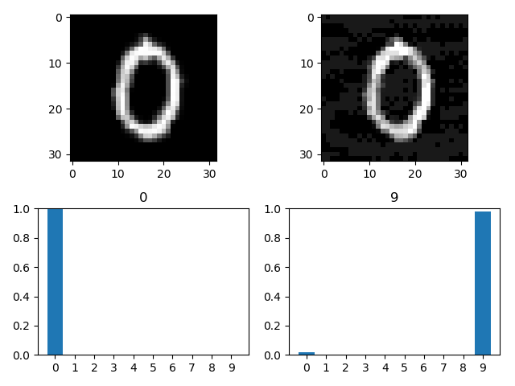|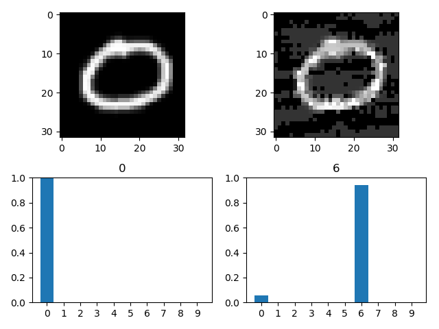|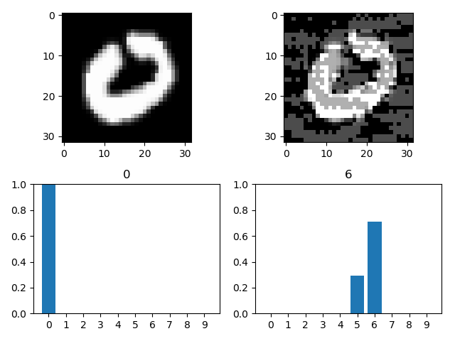|
|1|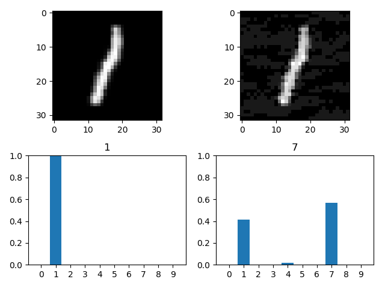||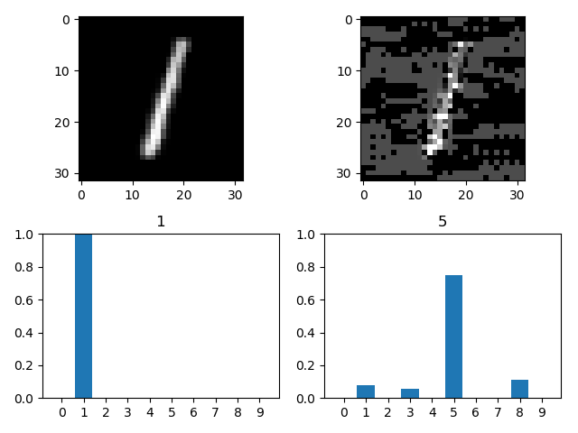|
|2|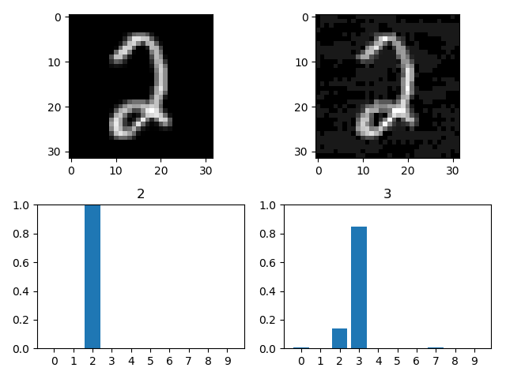|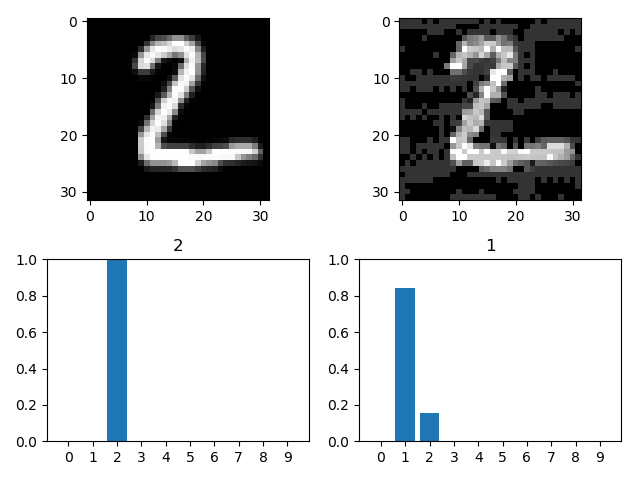|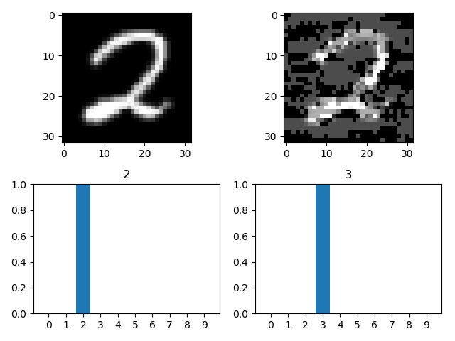|
|3|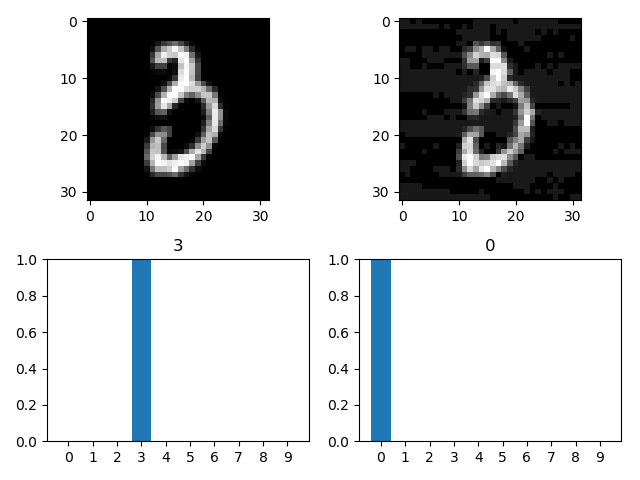|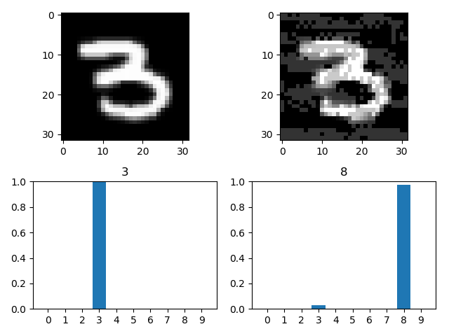|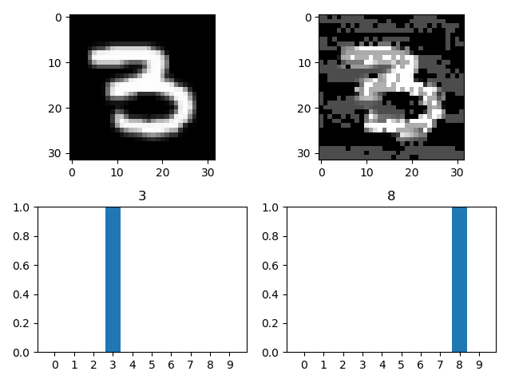|
|4|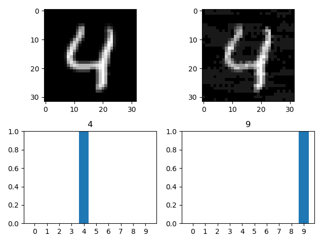|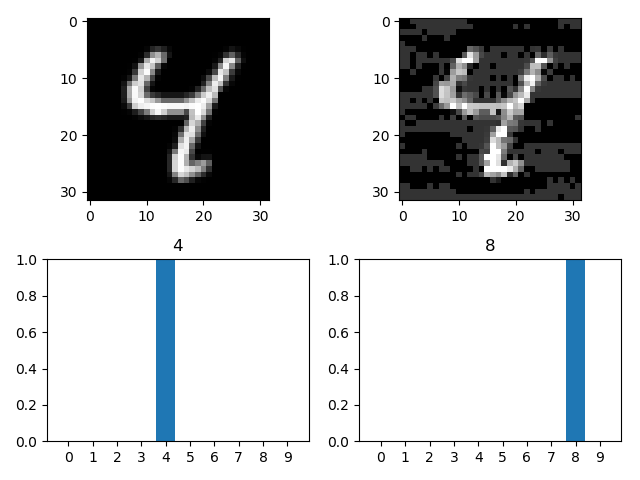|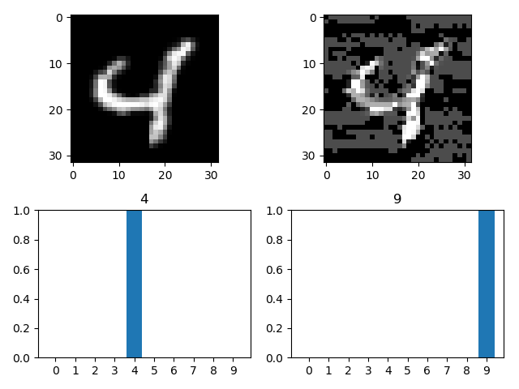|
|5|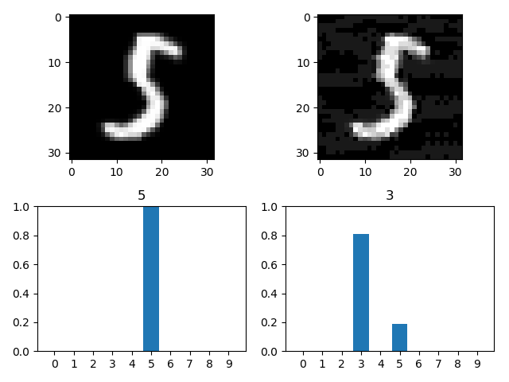|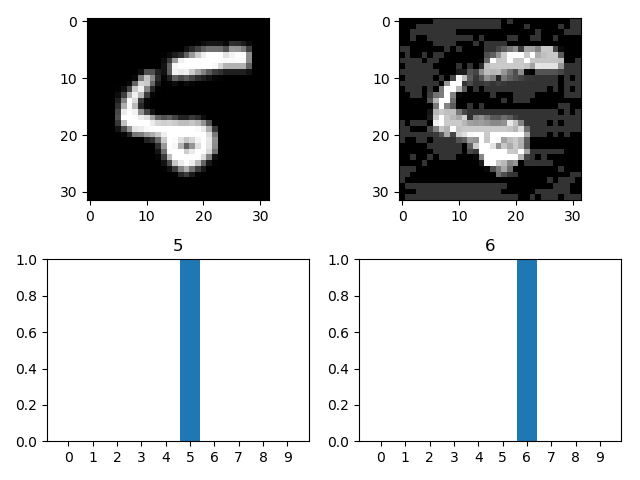|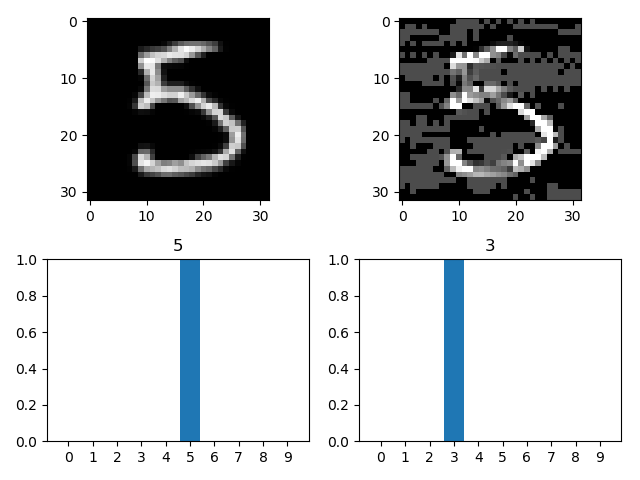|
|6|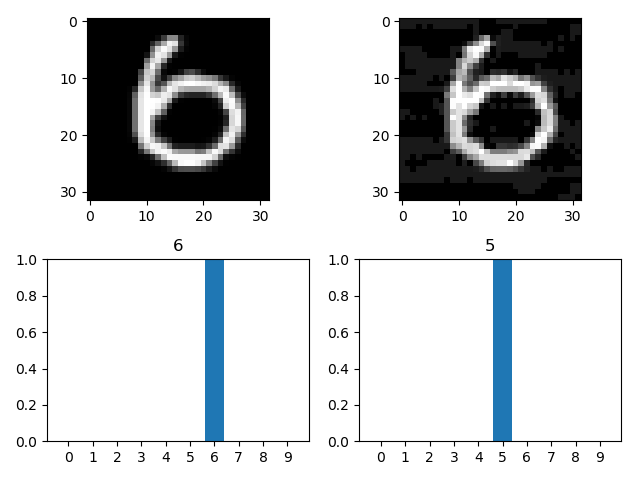|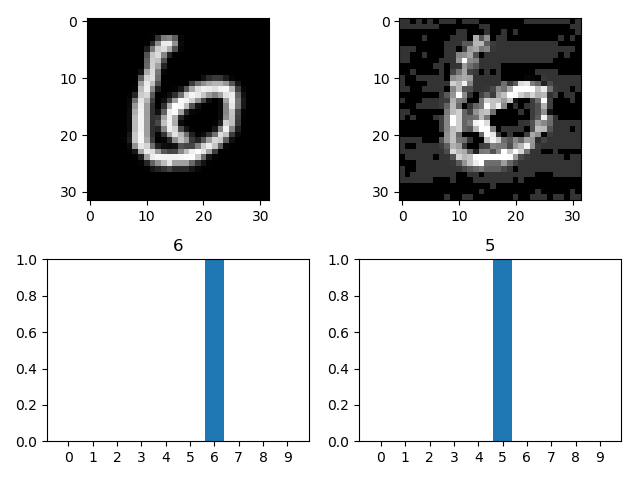|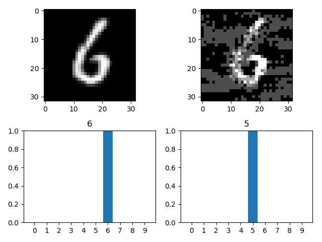|
|7|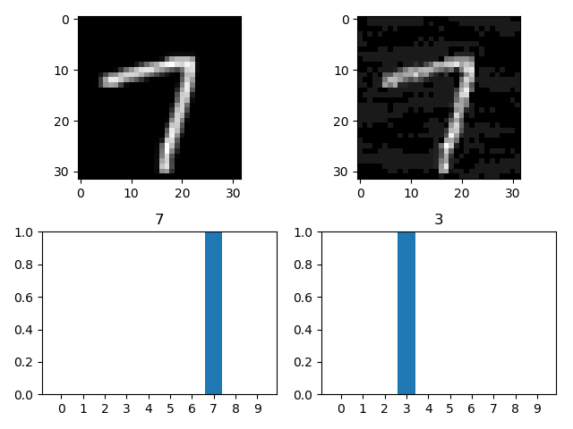|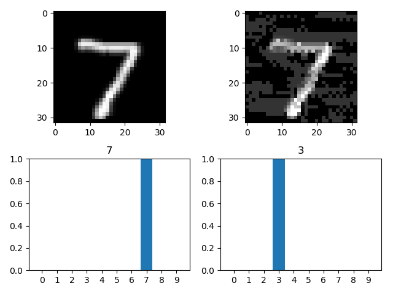|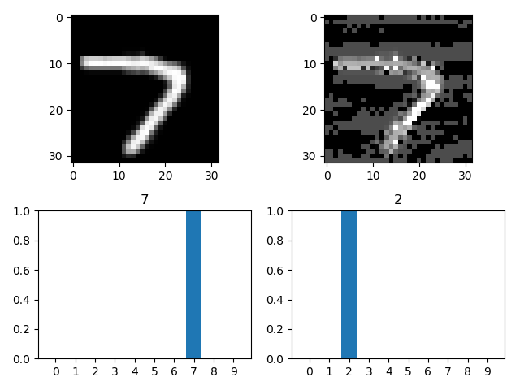|
|8|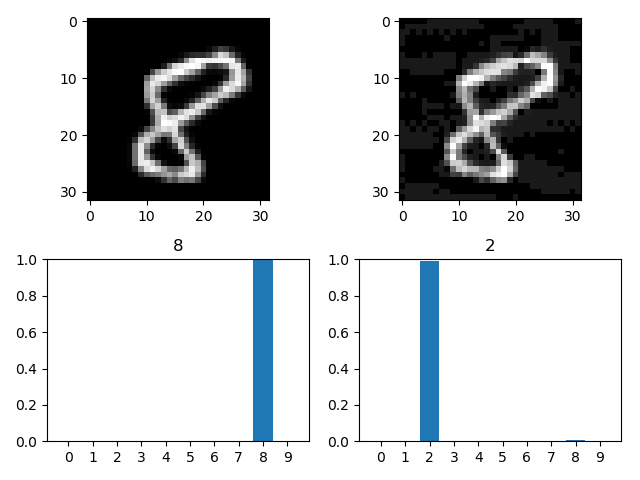|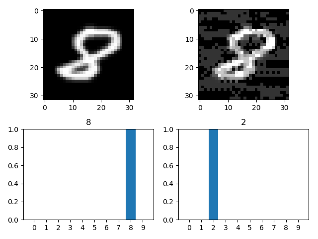|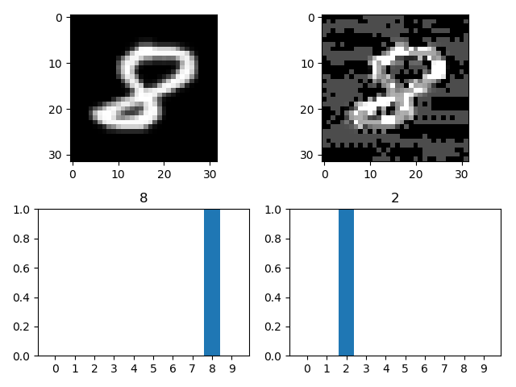|
|9|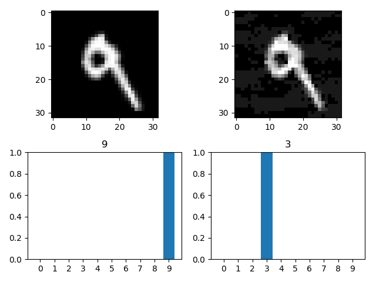|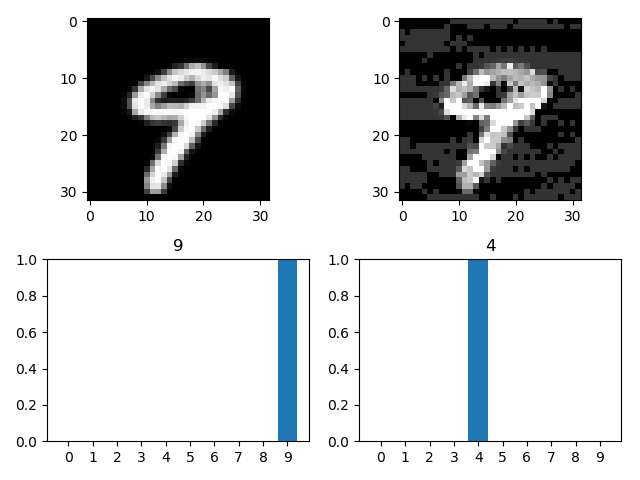|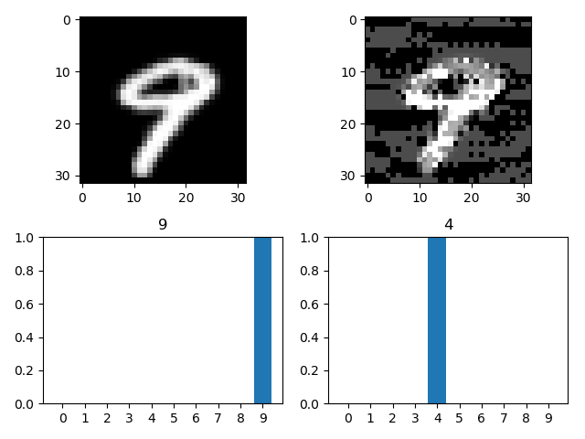|

